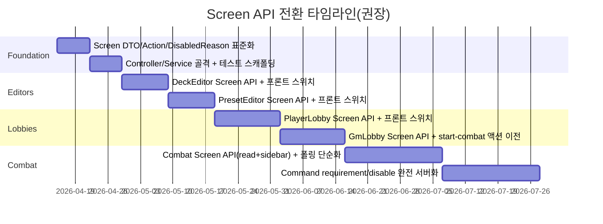

# 프론트·백엔드 책임 경계 재정의와 Screen API 설계 보고서

## Executive summary

현재 `duel-tower-ui`의 핵심 화면(Combat, PlayerLobby, GmLobby, DeckEditor, PresetEditor)은 “표시”를 넘어 **세션 동기화(polling), 콘텐츠 카탈로그/상세 로딩, 카드/로드아웃/프리셋 정규화, 화면용 ViewModel 생성, 커맨드 사전 검증과 disabled 판정, GM 토큰 복구 및 버전 미스매치 재시도**까지 다수의 계산 책임을 포함하고 있어(예: `CombatCommandPage.svelte`의 카드 resolve·playSpec 정규화·requirements 계산·이벤트 병합·명령 실행, `GmLobbyPage.svelte`의 START_COMBAT 복구/재시도 흐름) 파일이 커지고 변경 비용이 높아지는 구조다. fileciteturn74file0L1-L1 fileciteturn76file0L1-L1 이를 “프론트는 화면만”에 가깝게 만들려면, 각 화면이 필요로 하는 데이터를 서버에서 **화면 단위로 큐레이션(Backend for Frontends/BFF·Curated API)** 해서 내려주는 Screen API를 추가하고, 프론트는 그 응답을 거의 그대로 렌더링하며 “의도(intent)”만 전송하도록 경계를 재설계하는 것이 가장 직접적이다. citeturn1search10 citeturn1search9

## 범위와 근거

사용한 커넥터: entity["company","GitHub","code hosting platform"]

분석 기준 저장소: `Anim1048576/duel-tower`(기본 브랜치 `main`). fileciteturn2file0L1-L1

프로젝트는 단일 리포지토리 안에 **백엔드(Spring Boot + Gradle)** 와 **프론트(Svelte + Vite)** 가 공존한다. 로컬 실행 가이드는 JDK 17, Node.js 22, 백엔드 기본 포트 9009, 프론트는 `duel-tower-ui/` 디렉터리에서 작업함을 명시한다. fileciteturn44file0L1-L1 백엔드는 Gradle 설정에서 Spring Boot(4.0.3) 플러그인과 Web/Security/JPA/Validation 등을 사용한다. fileciteturn19file0L1-L1 Spring Boot 4.0.3 레퍼런스가 공식 문서에 “Stable”로 노출된다. citeturn2search0

세션 API는 `/api/sessions/**` 하위로 구성되어 있으며 `SessionController`는 `state`, `run`, `inventory`, `results`, `choices`, `recent-results`, `command` 등 다수 엔드포인트를 제공한다. fileciteturn22file0L1-L1 세션 이벤트/로그는 별도 컨트롤러로 제공된다. fileciteturn33file0L1-L1 권한 정책은 `docs/session-authorization-policy.md`에 “PUBLIC_SESSION_STATE / SESSION_READABLE / PLAYER_SELF / GM_ONLY …” 형태로 문서화되어 있다. fileciteturn42file0L1-L1

프론트의 라이브 세션 갱신은 기본적으로 800ms 간격으로 `/events`를 보고 변경 시 `/state`를 재조회하는 구조다. fileciteturn41file0L1-L1 이 구조 자체는 유지하되, **화면용 ViewModel과 disabled/가능 액션을 서버가 내려주는 Screen API**를 도입하면, 프론트의 로직(derived/guard/helper)을 대폭 줄일 수 있다.

## 프론트·백엔드 책임 경계 표

아래 표는 “현재 프론트 위치”를 가능한 한 **파일/함수(또는 derived 이름)** 단위로 명시하고, “권장 위치”를 **서버/프론트/공통**으로 구분한다.

| 책임 항목 | 현재 위치(프론트 파일/함수 경로) | 권장 위치 | 우선순위 |
|---|---|---:|---:|
| Combat: 카드 인스턴스 → 카드 정의 resolve(이름/타입/설명/태그/메타) | `CombatCommandPage.svelte`: `listCards()`, `getCard()`, `getCardDefinition()`, `resolveCombatCard()` fileciteturn74file0L1-L1 | 서버(Screen API) | 높음 |
| Combat: 카드 상세 캐시/로딩 큐 관리 | `CombatCommandPage.svelte`: `cardDetails`, `cardDetailLoadingIds`, `ensureCardDetail()` fileciteturn74file0L1-L1 | 서버(Screen API) | 높음 |
| Combat: playSpec 정규화 | `playSpec.ts`: `normalizePlaySpec()`(Combat에서 호출) fileciteturn37file0L1-L1 | 서버(Screen API) | 높음 |
| Combat: PLAY_CARD/USE_EX 요구사항 및 오류 계산 | `commandRequirements.ts`: `getPlayCardRequirementError()`, `buildCommandRequirementViewModel()` fileciteturn34file0L1-L1 | 서버(Screen API) | 높음 |
| Combat: command guard(턴 소유/토큰/펜딩/EX 가능 등) 계산 | `combatCommandDraft.ts`: `buildCombatCommandGuards()` fileciteturn38file0L1-L1 | 서버(Screen API) | 높음 |
| Combat: target/discard/selectedIds 필터링(핸드/필드/후보 제한) | `selectionFilters.ts`: `getSelectedDiscardIdsFromHand()`, `getSelectedFieldIds()` 등 fileciteturn36file0L1-L1 | 서버(Screen API) | 중간 |
| Combat: 이벤트 병합/정렬/사이드바 피드 구성 | `CombatCommandPage.svelte`: `mergeEventItems()`, `eventFeedEntries`, `logFeedEntries` fileciteturn74file0L1-L1 | 서버(Screen API) | 높음 |
| Combat: `CommandOptionViewModel`(버튼 disabled/메모) 구성 | `CombatCommandPage.svelte`: `commandOptions` derived fileciteturn74file0L1-L1 | 서버(Screen API) | 높음 |
| Combat: actor 파싱/턴 요약/상태 ViewModel | `CombatCommandPage.svelte`: `parseCombatActor()`, `buildStatusViewModel()` fileciteturn74file0L1-L1 | 서버(Screen API) | 중간 |
| Lobby(Player): 참가자 슬롯 라벨·톤·정렬 | `participantList.ts`: `buildPlayerLobbyParticipantItems()` fileciteturn63file0L1-L1 | 서버(Screen API) | 중간 |
| Lobby(Player): 로드아웃 요약/정규화/dirty 판정 | `loadoutEditor.ts`: `normalizeSessionLoadoutDraft()`, `isSessionLoadoutDraftDirty()` fileciteturn62file0L1-L1 | 서버(Screen API) | 높음 |
| Lobby(Player): EX 카드 “인스턴스→defId” 해석 | `loadoutEditor.ts`: `resolveSessionLoadoutExCardId()` fileciteturn62file0L1-L1 | 서버(Screen API) | 높음 |
| Lobby(Player): 레퍼런스 카탈로그(캐릭터/카드/패시브) 병렬 로딩·오류 집계 | `referenceCatalog.ts`: `loadLobbyReferenceCatalogs()` fileciteturn64file0L1-L1 | 서버(Screen API) | 중간 |
| Lobby(Player): 프리셋 목록 로딩 및 selectedPresetId 자동 보정 | `referenceCatalog.ts`: `loadLobbyPresetCatalog()` fileciteturn64file0L1-L1 | 서버(Screen API) | 중간 |
| Lobby(Player): 프리셋 미리보기 정규화/해석 | `PlayerLobbyPage.svelte`: `selectedPresetPreviewState`, `resolvedPresetCharacter/ExCard` fileciteturn75file0L1-L1 | 서버(Screen API) | 중간 |
| Lobby(GM): 참가자 “캐릭터 추정” 알고리즘(덱/EX 기반 스코어링, ambiguous 판정) | `GmLobbyPage.svelte`: `buildCharacterSummary()` fileciteturn76file0L1-L1 | 서버(Screen API) | 높음 |
| Lobby(GM): 참가자 덱/패시브/EX 요약 및 태그 생성 | `GmLobbyPage.svelte`: `buildDeckSummary()`, `buildPassiveSummary()`, `buildParticipantTags()` fileciteturn76file0L1-L1 | 서버(Screen API) | 높음 |
| Lobby(GM): START_COMBAT 실행 흐름( gmToken 복구, version mismatch 1회 재시도, “이미 시작됨” 처리, 401 보정 ) | `GmLobbyPage.svelte`: `handleStartCombat()` fileciteturn76file0L1-L1 | 서버(Screen Action) | 최고 |
| DeckEditor: draft↔API 모델 변환, total 계산, dirty 비교 | `decks/editorModel.ts`: `toDeckEditorUpdateRequest()`, `getDeckEditorTotalCards()`, `isDeckEditorStateDirty()` fileciteturn60file0L1-L1 | 서버(Screen API) | 높음 |
| DeckEditor: 유효성 검사(signature, stale 판정) | `DeckEditorPage.svelte`: `getDeckValidationSignature()`, `validationIsStale` fileciteturn77file0L1-L1 | 서버(Screen API) | 중간 |
| PresetEditor: 식별자 정규화/중복 제거/dirty 비교 | `presets/editorModel.ts`: `normalizePresetEditorState()`, `normalizePresetIdentifierList()`, `isPresetEditorStateDirty()` fileciteturn61file0L1-L1 | 서버(Screen API) | 높음 |
| PresetEditor: timestamp 포맷팅(로케일) | `PresetEditorPage.svelte`: `formatPresetTimestamp()` fileciteturn78file0L1-L1 | 서버(Screen API) 또는 공통 | 낮음 |
| 라우팅: path builder, pattern match, normalizePath | `navigation.ts`: `pathBuilders`, `resolveRouteMatch()`, `matchRoutePattern()` fileciteturn58file0L1-L1 | 공통 | 중간 |
| 브라우저 히스토리 이동(pushState/replaceState + popstate dispatch) | 각 페이지의 `navigateTo()` (`CombatCommandPage`, `PlayerLobbyPage`, `GmLobbyPage` 등) fileciteturn74file0L1-L1 | 공통 | 중간 |
| 세션 토큰/코드 저장·정규화(sessionStorage) | `session/access.ts`: `readStoredSessionAccess()`, `setStoredSessionAccess()`, `normalizeSessionCode()` fileciteturn39file0L1-L1 | 프론트 | 낮음 |
| 라이브 세션 polling 인프라(800ms, event-limit, afterVersion) | `liveSessionPolling.ts`: `defaultLiveSessionPollIntervalMs=800`, `getSessionEvents()` 후 `getSessionState()` fileciteturn41file0L1-L1 | 공통(또는 서버 SSE로 대체) | 중간 |
| 에러 스키마 표준화(ApiErrorResponse) 재사용 | 백엔드 `ApiErrorResponse`, 엔진 응답의 `errorDetails` fileciteturn48file0L1-L1 fileciteturn49file0L1-L1 | 서버(표준) + 공통 타입 | 중간 |

아키텍처 관점에서 Screen API는 “도메인 API를 대체”하기보다는, **화면 요구(aggregation / transformation / action enablement)를 충족하는 전용 레이어(BFF)** 로 두는 것이 자연스럽다. citeturn1search10 citeturn1search9

```mermaid
graph TD
  UI[duel-tower-ui Screens] -->|GET (poll)| ScreenAPI[/api/screens/**/]
  UI -->|POST/PUT/DELETE| DomainAPI[/api/sessions/**<br/>/api/content/**<br/>/api/decks/**<br/>/api/presets/**/]

  ScreenAPI --> SessionQuery[SessionQueryService / StateMapper]
  ScreenAPI --> Access[SessionAccessResolver]
  ScreenAPI --> Content[Content services (cards/passives/characters)]
  ScreenAPI --> DeckSvc[DeckService]
  ScreenAPI --> PresetSvc[PresetService]

  DomainAPI --> Access
  DomainAPI --> Engine[Game Engine / rt.apply(cmd)]
  DomainAPI --> DeckSvc
  DomainAPI --> PresetSvc
```

## 현재 프론트 로직 지도

아래는 요청된 “대형 파일” 중심으로 **계산/derived/guard/helper** 를 정리한 지도다. “코드 위치”는 *파일명 + 함수명/derived 이름*으로 기재한다.

**CombatCommandPage.svelte**

- 계산·정규화·헬퍼
  - 라우팅/접근 안내: `getInvalidCombatAccessMessage()`, `getAccessNotice()`, `hasCombatReadAccess()`, `navigateTo()`, `syncCombatState()` fileciteturn74file0L1-L1  
  - 카드 카탈로그·상세 로딩/캐시: `loadCardCatalog()`, `getCardDefinition()`, `getCardDetail()`, `ensureCardDetail()`, `cardDetails`, `cardDetailLoadingIds`, `cardDetailErrors` fileciteturn74file0L1-L1  
  - 카드 resolve/UI 모델: `createUnresolvedCardView()`, `resolveCombatCard()`(카드 이름/타입/태그까지 구성) fileciteturn74file0L1-L1  
  - 전투 상태 해석/표현: `parseCombatActor()`, `buildTurnOrderSummary()`, `buildStatusViewModel()`, `buildPlayerViewModel()`, `buildEnemyViewModel()`, `buildSummonViewModel()` fileciteturn74file0L1-L1  
  - 사이드바 이벤트/로그/결과: `loadCombatEvents()`, `loadCombatLogs()`, `loadCombatRecentResults()`, `mergeEventItems()` fileciteturn74file0L1-L1  
  - 명령 실행/응답 처리: `handleSimpleCommand()`, `handlePlayerCardCommand()`, `handlePendingDecisionCommand()`, `handleRejectedCommandResponse()`, `syncEngineResponseSuccess()` fileciteturn74file0L1-L1  
- guard/사전 검증
  - 커맨드 가능 여부: `commandGuards = buildCombatCommandGuards(...)` derived fileciteturn74file0L1-L1  
  - PLAY_CARD/USE_EX 요구사항 검증: `normalizePlaySpec()`, `getPlayCardRequirementError()`, `buildCommandRequirementViewModel()` 연동 fileciteturn74file0L1-L1 fileciteturn37file0L1-L1 fileciteturn34file0L1-L1  
  - Pending decision 지원 여부: `getUnsupportedPendingDecisionMessage()` derived fileciteturn74file0L1-L1  
  - 선택값 필터링(핸드/필드/후보/순서): `selectedDiscardIdsFromHand`, `selectedFieldIds`, `pendingCandidateIds`, `orderedTieActorKeys` derived fileciteturn74file0L1-L1  
- derived 목록(대표)
  - 라우팅/세션: `routeSessionCode`, `requestedSessionCode`, `combatState`, `runState`, `statusView`, `accessRoleLabel`
  - 전투 뷰: `playerViews`, `enemyViews`, `summonViews`, `visiblePlayerView`, `currentTurnActor`, `currentEnemyView`
  - 선택/소스: `selectedEnemyView`, `selectedCardView`, `runtimePlayerState`, `runtimeExCardView`
  - 카드 상세/요구사항: `selectedCommandDefId`, `selectedCommandDetail`, `selectedCommandPlaySpec`, `selectedCommandRequirementView`
  - 명령 UI: `commandOptions`, `commandGuardMessage`, `selectedTargetLabels`
  - 사이드바: `mergedEventItems`, `eventFeedEntries`, `logFeedEntries`, `recentResultEntries`, `runNodeSummary` fileciteturn74file0L1-L1  

**PlayerLobbyPage.svelte**

- 계산·정규화·헬퍼
  - 접근 검증: `getInvalidAccessMessage()` fileciteturn75file0L1-L1  
  - 식별자 파싱/포맷: `parseIdentifierText()`, `formatIdentifierText()` fileciteturn75file0L1-L1  
  - 레퍼런스 resolve: `getResolvedCharacter()`, `getResolvedCard()`, `getResolvedPassive()`, `getResolvedOwnedCard()` fileciteturn75file0L1-L1  
  - 로드아웃 동기화: `syncLoadoutStateFromPlayer()`, `normalizeSessionLoadoutDraft()`, `isSessionLoadoutDraftDirty()` 연동 fileciteturn75file0L1-L1 fileciteturn62file0L1-L1  
  - 레퍼런스 카탈로그 로딩: `loadReferenceCatalogs()`(characters/cards/passives), `loadAvailablePresets()`(presets) fileciteturn75file0L1-L1  
  - 액션 흐름: `handleReadyToggle()`, `handleLeave()`, `handleSaveLoadout()`, `handleApplyPreset()` fileciteturn75file0L1-L1  
- guard/사전 검증
  - “characterId 필수/EX 필수/토큰 필수” 등의 로컬 검증이 `handleSaveLoadout()` 내부에 존재 fileciteturn75file0L1-L1  
  - `deckEditingLocked = characterChangePending` 같은 UI 잠금 로직 fileciteturn75file0L1-L1  
- derived 목록(대표)
  - 세션/플레이어: `routeSessionCode`, `currentPlayerId`, `currentPlayer`, `currentPlayerSummary`
  - 로비 통계: `participantItems`, `participantCount`, `readyCount`
  - 액션 가능 여부: `canEditOwnLoadout`, `canToggleReady`, `canLeaveSession`
  - 로드아웃 상태: `loadoutDirty`, `characterChangePending`, `resolvedDraftCharacter`, `resolvedDraftExCard`, `syncedResolvedExCard`
  - 프리셋: `selectedPreset`, `selectedPresetPreviewState`, `resolvedPresetCharacter`, `resolvedPresetExCard`
  - 미리보기 리스트: `deckOwnedCardItems`, `passivePreviewItems`, `presetDeckPreviewItems`, `presetPassivePreviewItems` fileciteturn75file0L1-L1  

**GmLobbyPage.svelte**

- 계산·정규화·헬퍼
  - 레퍼런스 카탈로그 로딩: `loadReferenceCatalogs()` fileciteturn76file0L1-L1  
  - 참가자 요약 계산: `buildCharacterSummary()`(스코어링/ambiguous), `buildDeckSummary()`, `buildPassiveSummary()`, `buildExSummary()`, `buildParticipantTags()` fileciteturn76file0L1-L1  
  - GM 액션: `handleKickPlayer()`, `handleResetSession()` fileciteturn76file0L1-L1  
  - START_COMBAT 복합 흐름: `handleStartCombat()`(gmToken 복구, version mismatch 재시도, 이미 시작 처리, 401 보정) fileciteturn76file0L1-L1  
- derived 목록(대표)
  - 세션/리스트: `routeSessionCode`, `participantItems`, `participantCount`, `readyCount`
  - 버튼 라벨/차단: `gmAccessLabel`, `kickActionLabel`, `resetActionLabel`, `startActionLabel`, `startBlockedMessage` fileciteturn76file0L1-L1  

**DeckEditorPage.svelte**

- 계산·정규화·헬퍼
  - 라우트 해석/모드 판정: `getDeckIdFromRoute()`, `isCreateDeckRoute()`, `enterCreateMode()` fileciteturn77file0L1-L1  
  - draft ↔ payload: `updatePayload`, `replaceCardsPayload` derived 및 `editorModel` 함수들 fileciteturn77file0L1-L1 fileciteturn60file0L1-L1  
  - validation signature/스테일 판정: `getDeckValidationSignature()`, `validationIsStale` fileciteturn77file0L1-L1  
- derived 목록(대표)
  - `deckNameLabel`, `deckTypeLabel`, `totalCards`, `editorDirty`
  - `updatePayload`, `replaceCardsPayload`, `actionButtonsDisabled`
  - `validationCardsSignature`, `validationIssueCount`, `validationIsStale`
  - `deckCardItems`, `selectedCardEntry`, `selectedCardPosition` fileciteturn77file0L1-L1  

**PresetEditorPage.svelte**

- 계산·정규화·헬퍼
  - 라우트 해석/모드: `getPresetIdFromRoute()`, `isCreatePresetRoute()`, `enterCreateMode()` fileciteturn78file0L1-L1  
  - 레퍼런스 카탈로그 로딩: `loadReferenceCatalogs()`(characters/cards/passives Promise.allSettled) fileciteturn78file0L1-L1  
  - 식별자 파싱/정규화: `parseIdentifierText()`, `normalizePresetEditorState()` 연동 fileciteturn78file0L1-L1 fileciteturn61file0L1-L1  
  - save/clone/delete 액션 흐름 + 로컬 사전검증: `handleSave()`, `handleClone()`, `handleDelete()` fileciteturn78file0L1-L1  
- derived 목록(대표)
  - `isCreateMode`, `editorDirty`, `editorControlsDisabled`
  - `resolvedCharacter`, `resolvedExCard`, `exCardOptions`, `deckCardOptions`
  - `deckCardItems`, `passiveItems`
  - `updatedAtLabel`, `createdAtLabel`, `saveButtonLabel`, `cloneButtonLabel` fileciteturn78file0L1-L1  

**lib/navigation.ts**

- 계산·헬퍼(라우팅 코어)
  - `routePaths`, `routePatterns`, `pathBuilders`
  - `matchRoutePattern()`, `resolveRouteMatch()`, `normalizePath()`, `resolvePage()` fileciteturn58file0L1-L1  

## Screen API 명세 설계

설계 목표는 “프론트는 화면만 그린다”에 가깝게, 서버가 **(1) 화면에 필요한 데이터를 이미 화면 중심으로 조립**하고, **(2) 현재 상태/권한에 따른 가능 액션과 disabled 이유를 구조화하여** 내려주는 것이다. 이 계층은 전형적으로 BFF/Curated API 패턴과 일치한다. citeturn1search10

### 공통 구조

`disabledReason`과 `possibleActions`는 5개 화면 모두 동일 구조로 통일하는 것을 권장한다. 백엔드가 이미 표준 에러 바디(`ApiErrorResponse`)를 갖고 있으므로, disabledReason도 유사한 필드 구성을 쓰면 프론트가 메시지 처리 코드를 줄일 수 있다. fileciteturn48file0L1-L1

**DisabledReason 구조(권장)**

```json
{
  "code": "RULE_NOT_TURN_OWNER",
  "userMessage": "현재 턴 소유자가 아니어서 실행할 수 없습니다.",
  "debugMessage": "runtimePlayerId != currentTurnPlayerId",
  "details": { "runtimePlayerId": "p1", "currentTurnPlayerId": "p2" }
}
```

**PossibleActions 구조(권장)**

```json
{
  "id": "combat.playCard",
  "label": "카드 사용",
  "method": "POST",
  "href": "/api/sessions/ABCD1234/command",
  "auth": "playerToken",
  "enabled": false,
  "disabledReason": {
    "code": "MISSING_SELECTION",
    "userMessage": "사용할 카드를 먼저 선택하세요.",
    "debugMessage": "selectedCardInstId is null",
    "details": null
  },
  "payloadTemplate": {
    "type": "PLAY_CARD",
    "expectedVersion": 128,
    "playerId": "p1",
    "cardId": "<cardInstId>",
    "targets": [],
    "discardIds": [],
    "selectedIds": []
  }
}
```

- `auth`: `"public" | "sessionReadable" | "playerToken" | "gmToken" | "loginCookie"` 중 하나를 권장한다. (현 서버 정책이 token 기반 + login fallback을 혼용하므로) fileciteturn42file0L1-L1  
- `payloadTemplate`는 “프론트가 어떤 필드를 보내야 하는지”를 단순 표기하는 용도이며, 프론트는 템플릿에 값만 채우는 수준으로 유지된다.

### Combat Screen API

**엔드포인트(권장)**  
- `GET /api/screens/sessions/{code}/combat`  
  - 권한: `SESSION_READABLE`(gmToken/playerToken/login fallback) 권장. 기존 `GET /api/sessions/{code}/state`가 공개(public)인 점을 고려해도, Combat 화면은 카드/로그/결과를 함께 내릴 가능성이 높아 먼저 `SESSION_READABLE`로 두는 편이 안전하다. fileciteturn42file0L1-L1  
  - 선택적 쿼리: `afterVersion`(number), `eventLimit`(number)  
  - 목적: “상태 + 카드 resolve + 사이드바(이벤트/로그/최근결과) + 가능 액션”을 화면 단위로 반환

**요청 DTO(쿼리) 필드**

| 필드 | 타입 | 설명 |
|---|---|---|
| afterVersion | number? | 클라이언트가 마지막으로 본 세션 버전. 변경 없으면 `changed=false`로 응답하거나 304를 고려 |
| eventLimit | number? | 사이드바 이벤트/로그 길이(기본 12는 기존 프론트 상수와 일치) fileciteturn74file0L1-L1 |

**응답 DTO(CombatScreenResponse) 필드(요약)**

| 필드 | 타입 | 설명 |
|---|---|---|
| screenKey | `"Combat"` | 화면 식별자 |
| sessionCode | string | 세션 코드 |
| version | number | 세션 버전 |
| changed | boolean | `afterVersion` 대비 변경 여부 |
| generatedAt | string(datetime) | 서버 생성 시각 |
| status | object | `buildStatusViewModel()`에 해당하는 요약(턴/라운드/요약 문자열 포함) fileciteturn74file0L1-L1 |
| access | object | role(gm/player/none), runtimePlayerId 등(기존 `buildCombatCommandGuards`가 계산하던 핵심만) fileciteturn38file0L1-L1 |
| actors | object | players/enemies/summons의 **이미 렌더 가능한 ViewModel** 배열(현재 프론트 `buildPlayerViewModel` 등 결과 형태) fileciteturn74file0L1-L1 |
| zones | object | visiblePlayer hand/field/grave/excluded/ex 등의 카드 리스트(카드 이름/태그 포함) |
| sidebar | object | events/logs/recentResults를 이미 `CombatFeedEntry` 형태로 제공(프론트 merge/format 제거) fileciteturn74file0L1-L1 |
| possibleActions | ActionDto[] | 실행 가능한 커맨드/리트라이/클리어 등 |
| uiNotices | string[] | 접근 복구/읽기 전용 안내 등(현재 `accessNoticeMessage`) fileciteturn74file0L1-L1 |

**예시 JSON 응답(축약)**

```json
{
  "screenKey": "Combat",
  "sessionCode": "ABCD1234",
  "version": 128,
  "changed": true,
  "generatedAt": "2026-04-15T10:20:30+09:00",
  "uiNotices": [
    "Player access restored for p1. Visible hand now follows that player when available."
  ],
  "status": {
    "round": 3,
    "phase": "MAIN",
    "currentActor": { "kind": "player", "id": "p1", "label": "p1", "tone": "success" },
    "turnOrderSummary": "p1 -> E:slime +3 more",
    "battlefieldSummary": "2 players | 1 enemies | 0 summons",
    "runSummary": "Node A | Combat",
    "tieGroupSummary": "No tie groups"
  },
  "access": {
    "role": "player",
    "runtimePlayerId": "p1",
    "expectedVersion": 128,
    "guards": {
      "canIssuePlayerCommand": true,
      "canResolvePendingCommand": false,
      "canClearRecentResultsCommand": true,
      "exAvailable": false
    }
  },
  "actors": {
    "players": [
      {
        "playerId": "p1",
        "stateLabel": "Ready",
        "stateTone": "success",
        "metrics": [{ "label": "Hand", "value": 5, "note": "Limit 7" }],
        "handCards": [
          { "instanceId": "uuid-1", "defId": "C001", "title": "Strike", "subtitle": "Attack", "unresolved": false, "tags": [{ "label": "Attack" }] }
        ]
      }
    ],
    "enemies": [
      { "enemyId": "slime", "stateLabel": "Active", "stateTone": "accent", "metrics": [{ "label": "HP", "value": "12/20", "note": "Current / max" }] }
    ],
    "summons": []
  },
  "zones": {
    "visiblePlayerId": "p1",
    "hand": [{ "instanceId": "uuid-1", "defId": "C001", "title": "Strike", "subtitle": "Attack", "unresolved": false, "tags": [{ "label": "Attack" }] }],
    "field": [],
    "grave": [],
    "excluded": []
  },
  "sidebar": {
    "events": [
      { "title": "TURN_START", "lines": ["Version 128 | Cursor 994", "2026-04-15T10:20:29+09:00"] }
    ],
    "logs": [],
    "recentResults": []
  },
  "possibleActions": [
    {
      "id": "combat.draw",
      "label": "Draw",
      "method": "POST",
      "href": "/api/sessions/ABCD1234/command",
      "auth": "playerToken",
      "enabled": true,
      "disabledReason": null,
      "payloadTemplate": { "type": "DRAW", "expectedVersion": 128, "playerId": "p1", "count": 1 }
    }
  ]
}
```

**Polling/refresh 권장 주기**  
- Combat: 기본 800ms(현 프론트와 동일) + `afterVersion` 기반으로 “변경 없으면 lightweight 응답”을 유도하는 것을 권장한다. fileciteturn41file0L1-L1  
- 추가 최적화 옵션: `GET /api/screens/.../combat` 자체가 `events`를 포함해 “변경 감지 + 화면 모델”을 1회 호출로 끝내면, 현재의 “events → state 2단계”를 단순화할 수 있다. fileciteturn41file0L1-L1

### PlayerLobby Screen API

**엔드포인트(권장)**  
- `GET /api/screens/sessions/{code}/player-lobby`  
  - 권한: `PLAYER_SELF`에 준하는 “playerToken + playerId” 기반을 권장(현 페이지가 player access 없으면 진입 불가). fileciteturn75file0L1-L1  
- `POST /api/screens/sessions/{code}/player-lobby/actions/{actionId}` (선택)  
  - 예: `toggleReady`, `leave`, `saveLoadout`, `applyPreset` 를 통합 액션으로 제공하면 프론트는 “actionId + draft payload”만 전송하는 형태로 더 얇아진다.

**응답 DTO(요약)**

| 필드 | 타입 | 설명 |
|---|---|---|
| screenKey | `"PlayerLobby"` | 화면 식별 |
| sessionCode/version | string/number | 세션 요약 |
| participantSlots | array | `ParticipantSlot`에 바로 주입 가능한 항목(slot/name/state/tone/note) fileciteturn75file0L1-L1 |
| me | object | currentPlayerId, ready, loadout(synced), draft(초기값), summary 문자열 |
| references | object | characters/cards/passives/ownedCards를 “선택 옵션 + resolve 결과” 중심으로 제공(프론트의 `getResolved*` 제거) fileciteturn75file0L1-L1 |
| presets | object | preset 목록과 선택 상태 + 미리보기 resolve(프론트 `selectedPresetPreviewState` 제거) fileciteturn75file0L1-L1 |
| possibleActions | ActionDto[] | ready/leave/save/apply 등 |

**예시 JSON 응답(축약)**

```json
{
  "screenKey": "PlayerLobby",
  "sessionCode": "ABCD1234",
  "version": 55,
  "generatedAt": "2026-04-15T10:20:30+09:00",
  "participantSlots": [
    { "slot": "P1", "name": "p1 (You)", "state": "You Joined", "tone": "accent", "note": "Deck 10 cards | 2 passives | EX C_EX_01" }
  ],
  "me": {
    "playerId": "p1",
    "ready": false,
    "loadout": {
      "characterId": 101,
      "exCardId": "C_EX_01",
      "deckOwnedCardIds": ["OC-1", "OC-2"],
      "passiveIds": ["P001"]
    },
    "summary": "Deck 2 cards | 1 passives | EX C_EX_01",
    "draft": {
      "characterId": 101,
      "exCardId": "C_EX_01",
      "deckOwnedCardIds": ["OC-1", "OC-2"],
      "passiveIds": ["P001"]
    },
    "draftFlags": {
      "dirty": false,
      "deckEditingLocked": false
    }
  },
  "references": {
    "characterOptions": [{ "id": 101, "label": "Alice #101" }],
    "exCardOptions": [{ "id": "C_EX_01", "label": "Meteor (C_EX_01)" }],
    "passiveOptions": [{ "id": "P001", "label": "Quick Step (P001)" }],
    "ownedCardOptions": [{ "id": "OC-1", "label": "Strike (OC-1)" }]
  },
  "presets": {
    "items": [{ "id": 10, "label": "Preset A | Character #101 | 12 cards | 2 passives" }],
    "selectedId": "10",
    "preview": {
      "characterLabel": "Alice #101",
      "exLabel": "Meteor (C_EX_01)",
      "deckItems": [{ "title": "Strike (C001)", "tags": ["Attack"] }],
      "passiveItems": [{ "title": "Quick Step (P001)" }]
    }
  },
  "possibleActions": [
    {
      "id": "playerLobby.toggleReady",
      "label": "Ready up",
      "method": "PUT",
      "href": "/api/sessions/ABCD1234/players/p1/ready",
      "auth": "playerToken",
      "enabled": true,
      "disabledReason": null,
      "payloadTemplate": { "ready": true }
    }
  ]
}
```

**Polling/refresh 권장 주기**  
- PlayerLobby: 1000~1500ms 권장(Combat보다 UX 민감도가 낮고, 과도한 폴링이 불필요). 현 구조(`createLiveSessionPage`)는 interval 옵션을 지원하므로 Screen API 채택 시 함께 조정 가능하다. fileciteturn40file0L1-L1

### GmLobby Screen API

**엔드포인트(권장)**  
- `GET /api/screens/sessions/{code}/gm-lobby`  
  - 권한: `SESSION_READABLE` 또는 `GM_ONLY` 중 선택. 현재 GM 로비는 “상태 로딩은 공개/읽기 가능, 액션은 GM 토큰 필요” 구조이므로, Screen API는 최소한 `SESSION_READABLE`로 놓고 `possibleActions`에서 GM 토큰 유무에 따라 enabled를 결정하는 방식이 현실적이다. fileciteturn76file0L1-L1 fileciteturn42file0L1-L1  
- `POST /api/screens/sessions/{code}/gm-lobby/start-combat` (강력 권장)  
  - 현재 프론트 `handleStartCombat()`이 수행하는 복구/재시도 로직을 서버로 이동해 “한 번의 호출”로 끝내기 위한 액션 엔드포인트.

**응답 DTO(요약)**

| 필드 | 타입 | 설명 |
|---|---|---|
| participantCards | array | 현재 프론트가 조립하는 `LobbyParticipantItem`(characterSummary/exSummary/deckSummary/태그 포함)을 그대로 제공 fileciteturn76file0L1-L1 |
| startCombat | object | startBlockedMessage 및 start 가능한 player 후보 목록, 추천 시작 playerId도 서버가 결정 |
| possibleActions | ActionDto[] | kick/reset/start 등 |

**예시 JSON 응답(축약)**

```json
{
  "screenKey": "GmLobby",
  "sessionCode": "ABCD1234",
  "version": 55,
  "generatedAt": "2026-04-15T10:20:30+09:00",
  "participantCards": [
    {
      "slot": "P1",
      "name": "p1",
      "readyLabel": "Ready",
      "readyTone": "success",
      "characterSummary": "Likely Alice #101",
      "exSummary": "Meteor (C_EX_01)",
      "passiveSummary": "2 equipped | Quick Step +1 more",
      "deckSummary": "10 cards | 8 unique | Strike +2 more",
      "detailTags": [
        { "label": "10 deck cards", "tone": "accent" },
        { "label": "2 passives", "tone": "success" },
        { "label": "EX linked", "tone": "warning" }
      ]
    }
  ],
  "startCombat": {
    "recommendedStartPlayerId": "p1",
    "blockedReason": null
  },
  "possibleActions": [
    {
      "id": "gmLobby.startCombat",
      "label": "Start combat",
      "method": "POST",
      "href": "/api/screens/sessions/ABCD1234/gm-lobby/start-combat",
      "auth": "gmToken",
      "enabled": true,
      "disabledReason": null,
      "payloadTemplate": { "startPlayerId": "p1" }
    }
  ]
}
```

**Polling/refresh 권장 주기**  
- GmLobby: 1000~2000ms 권장. “START_COMBAT 실행 직전”에는 즉시 refresh(또는 액션 응답이 최신 화면 모델을 포함)로 대체한다. fileciteturn76file0L1-L1

### DeckEditor Screen API

**엔드포인트(권장)**  
- `GET /api/screens/decks/{id}/editor`  
- `GET /api/screens/decks/new/editor` (create 모드 전용)

Deck 편집은 실시간 폴링이 핵심이 아니므로, Screen API는 “초기 로딩 + 저장/검증 후 새 모델 반환”에 초점을 둔다. 현재는 프론트가 `DeckEditorState`를 생성/dirty 비교/카드 합계 계산을 수행한다. fileciteturn77file0L1-L1 fileciteturn60file0L1-L1

**응답 DTO(요약)**

| 필드 | 타입 | 설명 |
|---|---|---|
| mode | `"create"|"edit"` | 편집 모드 |
| deck | object? | 원본 DeckResponse 일부 |
| draft | object | 편집용 draft(서버가 생성한 키/정렬 포함) |
| derived | object | totalCards, dirty, 버튼 라벨/톤 등(프론트 derived 제거) |
| validation | object? | 마지막 validation 결과/스테일 여부 |
| possibleActions | ActionDto[] | validate/save/create/delete |

**예시 JSON 응답(축약)**

```json
{
  "screenKey": "DeckEditor",
  "mode": "edit",
  "deckId": 12,
  "generatedAt": "2026-04-15T10:20:30+09:00",
  "draft": {
    "name": "Starter Deck",
    "type": "PLAYER",
    "cards": [
      { "key": "deck-card-1", "cardId": "C001", "count": 2, "position": 1 }
    ]
  },
  "derived": {
    "title": "Starter Deck",
    "deckTypeLabel": "PLAYER",
    "totalCards": 2,
    "dirty": false
  },
  "validation": {
    "valid": true,
    "normalizedTotalCards": 2,
    "issues": [],
    "isStale": false
  },
  "possibleActions": [
    {
      "id": "deckEditor.validate",
      "label": "Validate deck",
      "method": "POST",
      "href": "/api/content/decks/12/validate",
      "auth": "loginCookie",
      "enabled": true,
      "disabledReason": null,
      "payloadTemplate": { "cards": [{ "cardId": "C001", "count": 2 }] }
    }
  ]
}
```

**Polling/refresh 권장 주기**  
- 없음(사용자 액션 기반). 필요 시 “Validate 버튼” 클릭 시 최신 screen 응답을 받도록 한다.

### PresetEditor Screen API

**엔드포인트(권장)**  
- `GET /api/screens/presets/{id}/editor`  
- `GET /api/screens/presets/new/editor`

**응답 DTO(요약)**

| 필드 | 타입 | 설명 |
|---|---|---|
| preset | object? | PresetResponse 일부(소유자/타임스탬프 포함) fileciteturn55file0L1-L1 |
| draft | object | name/characterId/deckCardIds/exCardId/passiveIds (정규화된 상태) fileciteturn61file0L1-L1 |
| resolved | object | character/ex/card/passive의 “라벨+메타+설명” 미리보기 리스트 |
| derived | object | dirty, 버튼 라벨, timestamp label 등 |
| possibleActions | ActionDto[] | save/create/clone/delete |

**예시 JSON 응답(축약)**

```json
{
  "screenKey": "PresetEditor",
  "mode": "edit",
  "presetId": 10,
  "generatedAt": "2026-04-15T10:20:30+09:00",
  "draft": {
    "name": "Preset A",
    "characterId": 101,
    "deckCardIds": ["C001", "C002"],
    "exCardId": "C_EX_01",
    "passiveIds": ["P001"]
  },
  "resolved": {
    "characterLabel": "Alice #101",
    "exLabel": "Meteor (C_EX_01)",
    "deckItems": [
      { "title": "Strike (C001)", "subtitle": "Attack", "meta": "Entry 1 | Cost 1", "tags": ["Attack"] }
    ],
    "passiveItems": [
      { "title": "Quick Step (P001)", "subtitle": "Passive", "meta": "Entry 1 | Priority 10" }
    ]
  },
  "derived": {
    "dirty": false,
    "updatedAtLabel": "2026. 4. 15. 오전 10:19",
    "createdAtLabel": "2026. 4. 10. 오후 6:40"
  },
  "possibleActions": [
    {
      "id": "presetEditor.save",
      "label": "Save preset",
      "method": "PUT",
      "href": "/api/presets/10",
      "auth": "loginCookie",
      "enabled": true,
      "disabledReason": null,
      "payloadTemplate": {
        "name": "Preset A",
        "characterId": 101,
        "deckCardIds": ["C001", "C002"],
        "exCardId": "C_EX_01",
        "passiveIds": ["P001"]
      }
    }
  ]
}
```

**Polling/refresh 권장 주기**  
- 없음(사용자 액션 기반).

## 마이그레이션 권장 순서와 단계별 체크리스트

현재 코드에서 “큰 파일을 더 쪼개는 리팩터링”만으로는 계산 책임이 남는다. 따라서 **서버에 Screen API를 먼저 만들고, 프론트는 점진적으로 그 응답만 소비**하도록 전환하는 순서를 권장한다. 서버는 세션 권한 정책과 에러 스키마가 이미 정리되어 있어 Screen API 도입에 필요한 기반이 갖춰져 있다. fileciteturn42file0L1-L1 fileciteturn48file0L1-L1



**단계 A: 서버 Screen API 기반(표준 DTO/서비스) 구축**

- [ ] `/api/screens/**` 네임스페이스를 위한 `ScreenController`(또는 도메인별 Screen 컨트롤러) 생성
- [ ] `DisabledReasonDto`, `ScreenActionDto`, `ScreenResponseBase` 공통 DTO 정의(프론트가 그대로 렌더 가능한 필드 중심)
- [ ] 서버 에러 바디(`ApiErrorResponse`)와 disabledReason의 필드 호환 전략 결정(동일 필드명 권장) fileciteturn48file0L1-L1
- [ ] 세션 권한: `docs/session-authorization-policy.md`의 그룹과 Screen API의 권한 요구를 매핑(Combat/GmLobby/PlayerLobby) fileciteturn42file0L1-L1
- [ ] `SessionQueryService` 분리 원칙에 맞춰 Screen API가 “조회”를 우선 재사용하도록 구성(컨트롤러 얇게) fileciteturn43file0L1-L1
- [ ] `afterVersion`(또는 ETag) 기반 폴링 계약 초안 확정(변경 없음 응답 형태 포함)
- [ ] 통합 테스트(계약 테스트) 스캐폴딩: “ScreenResponse는 필수 필드 존재/타입 일치” 검증
- [ ] 프론트에 “Screen fetch 공통 클라이언트”(`getScreen(screenKey, params)`)만 먼저 추가(기능 토글로 병행 가능)

**단계 B: Editor 계열(DeckEditor, PresetEditor) Screen API부터 전환**

- [ ] DeckEditor: `GET /api/screens/decks/{id}/editor`, `GET /api/screens/decks/new/editor` 구현
- [ ] DeckEditor 응답에 `draft`, `derived(totalCards/dirty)`, `validation(last)`를 포함해 프론트 `getDeckEditorTotalCards/isDeckEditorStateDirty` 제거 목표 설정 fileciteturn60file0L1-L1
- [ ] DeckEditor의 `possibleActions`에 validate/save/create/delete를 포함하고, action 호출을 generic invoke로 교체
- [ ] PresetEditor: `GET /api/screens/presets/{id}/editor`, `GET /api/screens/presets/new/editor` 구현
- [ ] PresetEditor 응답에 resolve된 preview(items/meta/tags)를 포함해 프론트 `buildResolvedDeckCardItem/buildResolvedPassiveItem` 제거 목표 설정 fileciteturn78file0L1-L1
- [ ] 프론트 Editor 페이지에서 `$derived.by`를 최소화하고, “응답 렌더 + 입력값 상태”만 남도록 정리 fileciteturn77file0L1-L1 fileciteturn78file0L1-L1
- [ ] Editor 관련 페이지별 라우트 파싱(`resolveRouteMatch`)을 공통 라우터 유틸로 이동해 중복 제거 fileciteturn58file0L1-L1
- [ ] Editor 전환 완료 후 `lib/decks/editorModel.ts`, `lib/presets/editorModel.ts`의 “서버로 옮길 수 있는 계산” 목록을 남겨 다음 단계(삭제/축소) 대상으로 표시 fileciteturn60file0L1-L1 fileciteturn61file0L1-L1

**단계 C: PlayerLobby Screen API 전환**

- [ ] `GET /api/screens/sessions/{code}/player-lobby` 구현(참가자 슬롯 + 내 상태 + references + presets + possibleActions)
- [ ] server가 참가자 슬롯의 `tone/state/note`까지 계산해 전달(프론트 `buildParticipantItems`, `formatPlayerLoadoutSummary` 제거) fileciteturn75file0L1-L1
- [ ] loadout draft 관련: 서버가 `dirty`, `deckEditingLocked`, `requiredFieldsMissing` 등을 계산해 disabledReason 제공(프론트의 사전 검증 최소화) fileciteturn75file0L1-L1
- [ ] references: characters/cards/passives/ownedCards를 “선택 옵션 + resolve 결과” 중심으로 제공(프론트의 `getResolved*` 제거) fileciteturn75file0L1-L1
- [ ] action: ready/leave/save/apply를 `possibleActions` 기반으로 호출하도록 변경(각 handler는 1~2개로 축소)
- [ ] 폴링: 기존 `createLiveSessionPage` 구조를 유지하되, polling 응답을 Screen API로 바꾸고 interval을 1000~1500ms로 조정 fileciteturn40file0L1-L1
- [ ] 프론트에서 `referenceCatalog.ts`의 로비 전용 데이터 로딩 로직을 제거하거나 Screen API로 대체 fileciteturn64file0L1-L1
- [ ] 회귀 테스트: “player token 없이 접근 시 invalidAccessMessage”, “saveLoadout 시 서버 error schema 노출” 확인 fileciteturn44file0L1-L1

**단계 D: GmLobby Screen API 전환 + start-combat 액션 서버화**

- [ ] `GET /api/screens/sessions/{code}/gm-lobby` 구현(참가자 카드 + start 후보 + possibleActions)
- [ ] 참가자 요약(캐릭터 추정/덱 미리보기/패시브 라벨/태그)을 서버로 이전(프론트 `buildCharacterSummary` 삭제) fileciteturn76file0L1-L1
- [ ] `POST /api/screens/sessions/{code}/gm-lobby/start-combat` 구현  
  - gmToken 없거나 401이면 “restore gm access”를 서버가 수행하거나, 불가능하면 disabledReason 반환 fileciteturn76file0L1-L1  
  - version mismatch 시 서버가 “최신 state 재확인 후 1회 재시도” (현재 프론트 로직과 동일한 정책) fileciteturn76file0L1-L1
- [ ] kick/reset은 Screen action으로 감싸거나 기존 엔드포인트를 그대로 노출하되 enabled/disabled 판단은 서버가 제공
- [ ] startBlockedMessage를 서버에서 계산해 전달(프론트는 메시지 렌더만) fileciteturn76file0L1-L1
- [ ] 폴링: 1000~2000ms로 완화하고, start-combat 액션 성공 응답에 “다음 이동 URL” 또는 “combat screenKey”를 포함
- [ ] 프론트에서 `restoreGmAccess` 직접 호출 제거(서버 액션 경유) fileciteturn76file0L1-L1
- [ ] 회귀 테스트: “combat already started” 케이스가 즉시 combat으로 이동하는지 확인(현재 동작 유지) fileciteturn76file0L1-L1

**단계 E: Combat Screen API 전환(가장 큰 효과, 가장 큰 작업)**

- [ ] `GET /api/screens/sessions/{code}/combat` 구현(상태 + 카드 resolve + sidebar + possibleActions)
- [ ] 서버에서 카드 archive/상세 join을 수행해, 프론트 `listCards/getCard/ensureCardDetail` 제거 fileciteturn74file0L1-L1
- [ ] 서버에서 `commandOptions`(disabled + note) 제공(프론트 derived 제거) fileciteturn74file0L1-L1
- [ ] 서버에서 `selectedCommandRequirementView` 생성을 위한 “카드별 requirement 요약”을 제공하거나, on-demand requirement 엔드포인트 추가(프론트 `normalizePlaySpec`, `buildCommandRequirementViewModel` 제거) fileciteturn34file0L1-L1 fileciteturn37file0L1-L1
- [ ] 서버에서 이벤트/로그/최근결과를 “이미 feed entry”로 제공하여 `mergeEventItems/formatSidebarTimestamp` 제거 fileciteturn74file0L1-L1
- [ ] polling 단순화: Screen API가 `afterVersion`을 받아 “변경 없으면 lightweight” 응답, 변경 시 화면 모델 포함(가능하면 1회 호출로 끝내기) fileciteturn41file0L1-L1
- [ ] 프론트는 command draft(선택값)만 유지하고, 실제 guard/disable은 서버 값으로 렌더
- [ ] pending decision 지원 여부/필요 입력(schema)을 서버가 내려주도록 이전(프론트 switch-case 최소화) fileciteturn74file0L1-L1
- [ ] 커맨드 실행 결과(accepted/오류/최신 state 동기화)에서 “최신 combat screen”을 응답에 포함하도록 개선하여 프론트의 후처리 축소 fileciteturn49file0L1-L1
- [ ] 회귀 테스트: TURN 변경, 카드 사용, pending decision 해결, 최근 결과 clear가 기존과 동일하게 동작하는지 시나리오 테스트

**단계 F: 프론트 슬림화 마무리(삭제/공통화/규칙화)**

- [ ] 각 페이지에서 `navigateTo()` 중복 제거 → 공통 라우팅 유틸로 통합 fileciteturn58file0L1-L1
- [ ] `features/session/**`의 “UI 계산 전용” 모듈을 단계적으로 제거하거나, 서버로 옮긴 뒤 프론트에서는 타입만 유지(필요한 경우 `common`으로 분리)
- [ ] “프론트 계산 금지” 규약을 lint 규칙/리뷰 체크리스트로 반영: 화면 파일에서 `$derived.by`를 금지하거나 상한선 설정
- [ ] API 타입 통일: backend DTO ⇄ frontend type이 미스매치인 부분(예: 엔진 `errorDetails` 타입)을 정리 fileciteturn49file0L1-L1 fileciteturn31file0L1-L1
- [ ] 문서화: Screen API 계약, 권한 요구, 폴링 주기, 장애 시 fallback 문서 추가(현재 docs 스타일 활용) fileciteturn43file0L1-L1
- [ ] 성능 점검: Combat 화면 payload 크기/폴링 빈도로 인한 부하 측정 및 최적화(필요 시 이벤트 델타 포함)
- [ ] 프론트 페이지 파일 길이/복잡도 지표를 CI에서 측정(라인 수, 함수 수, derived 수)
- [ ] “도메인 로직은 서버” 원칙이 유지되는지 코드 오너십/디렉터리 구조 재정렬

## 완료 기준

정량 기준(권장)

- Combat/PlayerLobby/GmLobby/DeckEditor/PresetEditor 각 페이지에서 `$derived.by` 선언 수가 **5개 이하**(가능하면 0~2개)로 감소하고, 대부분이 “응답 unpack + 렌더”로 전환된다. fileciteturn74file0L1-L1 fileciteturn75file0L1-L1  
- 위 5개 페이지에서 “비즈니스 규칙 계산” 함수(예: requirement/guard/summary 생성)가 **0개**가 된다(최대 허용: 단순 입력 파싱/폼 상태 처리).  
- 각 페이지 파일 길이 목표  
  - Combat: 1000+ 라인급 구조 재발 방지를 위해 **500 라인 이하**  
  - Lobby/Editors: **400 라인 이하**  
  (현재 파일 내 로직 밀도를 고려한 “상한선”으로 제안) fileciteturn74file0L1-L1 fileciteturn76file0L1-L1  
- Combat에서 프론트가 직접 호출하던 `listCards/getCard` 경로가 사라지고, Screen API 1개(또는 소수) 호출로 대체된다. fileciteturn74file0L1-L1  
- GmLobby의 START_COMBAT 로직이 프론트에서 제거되고, 서버 `start-combat` 액션 1회 호출로 대체된다. fileciteturn76file0L1-L1  
- Screen API에 대한 계약 테스트가 최소 1개 이상 존재(필수 필드/권한/disabledReason 포함).

정성 기준(권장)

- 프론트 기능 변경이 “UI 배치/스타일”과 “action binding” 중심으로 축소되고, 게임 룰/권한/요구사항 변경은 서버 코드에서만 수행 가능하도록 경계가 명확해진다.
- 오류 메시지/disabledReason가 일관된 구조로 제공되어, 프론트는 “에러 바디를 그대로 표시”하는 패턴으로 단순화된다. fileciteturn48file0L1-L1
- 폴링/리프레시 정책이 문서화되어, 화면별(Combat vs Lobby vs Editor) 리소스 사용이 합리적으로 유지된다. fileciteturn41file0L1-L1

## 참고한 코드 위치와 우선 참조 파일 목록

| GitHub 경로 | 우선 참조 이유 |
|---|---|
| `duel-tower-ui/src/pages/CombatCommandPage.svelte` | Combat 화면의 계산 책임이 가장 집중(카드 resolve, requirement, guards, sidebar feed, command 실행) fileciteturn74file0L1-L1 |
| `duel-tower-ui/src/pages/PlayerLobbyPage.svelte` | Player 로비: loadout/preset/reference 병합과 로컬 사전 검증·미리보기 계산 fileciteturn75file0L1-L1 |
| `duel-tower-ui/src/pages/GmLobbyPage.svelte` | GM 로비: 참가자 요약 계산 + START_COMBAT 복구/재시도 로직의 핵심 fileciteturn76file0L1-L1 |
| `duel-tower-ui/src/pages/DeckEditorPage.svelte` | Editor 패턴의 전형(라우팅/모드/dirty/validation) fileciteturn77file0L1-L1 |
| `duel-tower-ui/src/pages/PresetEditorPage.svelte` | Preset 편집: reference 로딩 + 정규화 + CRUD 액션 흐름 fileciteturn78file0L1-L1 |
| `duel-tower-ui/src/lib/navigation.ts` | 라우팅/패턴 매칭/URL 생성 공통부, 중복 제거 후보 fileciteturn58file0L1-L1 |
| `duel-tower-ui/src/lib/session/liveSessionPolling.ts` | 폴링 주기(800ms)·이벤트 기반 갱신의 현재 계약 fileciteturn41file0L1-L1 |
| `duel-tower-ui/src/lib/session/liveSessionPage.ts` | live page 공통 훅(로드/폴링/에러 처리), Screen API로 교체 시 핵심 진입점 fileciteturn40file0L1-L1 |
| `duel-tower-ui/src/lib/session/combatCommandDraft.ts` | Combat guard/정규화/선택 dedupe 로직(서버로 이동할 핵심) fileciteturn38file0L1-L1 |
| `duel-tower-ui/src/features/session/combat/commandRequirements.ts` | 요구사항/사전검증 로직(서버화 1순위) fileciteturn34file0L1-L1 |
| `duel-tower-ui/src/features/session/combat/playSpec.ts` | playSpec 디코딩/정규화(서버에서 제공 가능) fileciteturn37file0L1-L1 |
| `duel-tower-ui/src/lib/session/loadoutEditor.ts` | 로드아웃 정규화/dirty/EX resolve(서버로 이동 권장) fileciteturn62file0L1-L1 |
| `duel-tower-ui/src/features/session/lobby/shared/participantList.ts` | 참가자 정렬/톤/라벨 생성(화면 ViewModel 레벨) fileciteturn63file0L1-L1 |
| `duel-tower-ui/src/features/session/lobby/shared/referenceCatalog.ts` | 로비 reference/preset 카탈로그 로딩(현재는 프론트에서 aggregation) fileciteturn64file0L1-L1 |
| `src/main/java/com/example/dueltower/session/api/SessionController.java` | 세션 도메인 API의 현재 엔드포인트·흐름(스크린 액션이 재사용/감싸야 함) fileciteturn22file0L1-L1 |
| `src/main/java/com/example/dueltower/session/api/SessionLogController.java` | logs/events 조회 경로(Combat screen sidebar 통합 대상) fileciteturn33file0L1-L1 |
| `docs/session-authorization-policy.md` | Screen API 권한 요구 매핑의 기준 문서 fileciteturn42file0L1-L1 |
| `docs/local-runbook.md` | 표준 실행 환경과 공통 API error schema(메시지 표준화 근거) fileciteturn44file0L1-L1 |
| `src/main/java/com/example/dueltower/common/api/ApiErrorResponse.java` | error/disabledReason 공통 구조 설계에 직접 재사용 가능 fileciteturn48file0L1-L1 |
| `src/main/java/com/example/dueltower/session/api/SessionCommandType.java` | 커맨드별 요구 필드/파싱 규칙, Screen Action 템플릿 생성 근거 fileciteturn72file0L1-L1 |
| `src/main/java/com/example/dueltower/content/deck/api/DeckController.java` | Deck editor가 최종적으로 호출할 도메인 API fileciteturn17file0L1-L1 |
| `src/main/java/com/example/dueltower/preset/api/PresetController.java` | Preset editor CRUD 도메인 API fileciteturn16file0L1-L1 |

외부 참고(패턴 근거)

- entity["company","Microsoft","technology company"] Azure Architecture Center: Backends for Frontends(BFF) pattern. citeturn1search10 
- entity["company","Amazon Web Services","cloud provider"] Prescriptive Guidance: micro-frontends에서의 BFF 역할(aggregation/transform/authorization). citeturn1search9

### DeckEditor Validation Boundary Note

- 서버 `validation` DTO는 "마지막으로 검증된 draft snapshot"만 표현한다.
- `validatedDraftSignature`는 검증 대상 draft의 deck type + ordered card entries + count를 요약한 식별자다.
- 프론트 stale 표시는 현재 로컬 editor draft와 `validatedDraftSignature` 비교 결과다.
- 이 stale 계산은 편집기 표현 상태를 위한 것이며, 게임 규칙 validation 자체를 프론트로 되돌리는 것이 아니다.
